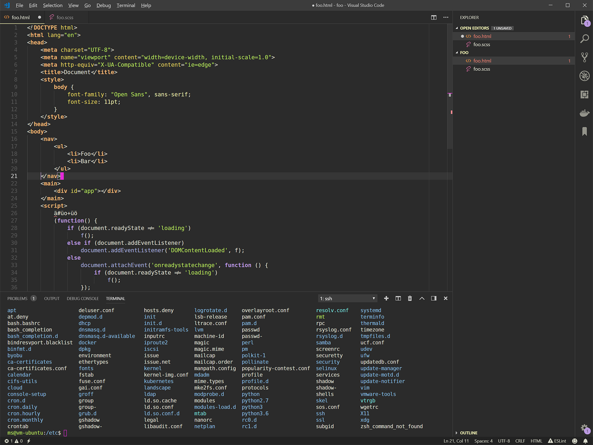

# Granite Theme

A dark [Visual Studio Code](https://code.visualstudio.com/) theme inspired by [Coal Graal](https://github.com/baskerville/Coal-Graal.tmTheme).

## Install

Install from the [Marketplace](https://marketplace.visualstudio.com/items?itemName=mdschweda.granite-theme) or use the [Extension panel](https://code.visualstudio.com/docs/editor/extension-gallery).

## Use

Press <kbd>F1</kbd> to bring up the Command Palette and type `Preferences: Color theme` (<kbd>CTRL</kbd> + <kbd>K</kbd>, <kbd>CTRL</kbd> + <kbd>T</kbd> by default) or click on `File` ➡ `Preferences` ➡ `Color Theme...`, choose `Granite`.

## License

All files are licensed under the [MIT license](https://opensource.org/licenses/MIT).

Author: [Marcus Schweda](https://github.com/mdschweda)